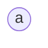
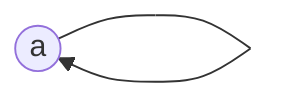
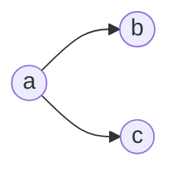
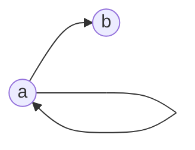
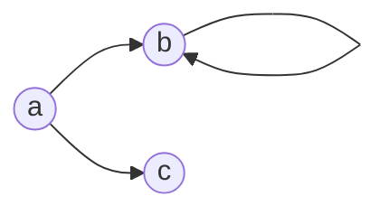
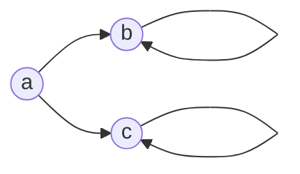

# CPSC-354 — Solution Homework 2 (Rewriting Theory RT1)

([homework](https://hackmd.io/@jweinberger/SJoCCbLufe))

Recall the definitions: An ARS $(A,\to)$ is **terminating** if there is no infinite chain $a_0\to a_1\to\ldots$, **confluent** if for every "peak" there is a "valley" (dashed arrows) joining the two computations:

An ARS **has unique normal forms (UNF)** if every element reduces to exactly one normal form.

## Solution 2.1

For each ARS we draw the directed graph and analyse termination (T), confluence (C), and unique normal forms (UNF).

**1.** $\quad A=\{\}$.

**Terminating:** Yes — **Confluent:** Yes — **UNF:** Yes
*Why:* Vacuous (no elements, no reductions).

**2.** $\quad A=\{a\}\quad$ and $\quad {R}=\{\}$.

**Terminating:** Yes — **Confluent:** Yes — **UNF:** Yes
*Why:* $a$ has no outgoing steps, so it is already a normal form (and the only one).

**3.** $\quad A=\{a\}\quad$ and $\quad {R}=\{(a,a)\}$.

(this is a loop on `a`, some renderers make this look funny)

**Terminating:** No — **Confluent:** Yes — **UNF:** No
*Why:* The infinite computation $a\to a\to\ldots$ shows non-termination; $a$ has no normal form, so UNF fails. Confluence holds vacuously (every peak is joinable via $a$).

**4.** $\quad A=\{a,b,c\}\quad$ and $\quad {R}=\{(a,b),(a,c)\}$.

**Terminating:** Yes — **Confluent:** No — **UNF:** No
*Why:* From $a$ one can reach the two distinct normal forms $b$ and $c$, which are not joinable.

**5.** $\quad A=\{a,b\}\quad$ and $\quad {R}=\{(a,a),(a,b)\}$.

(there is a loop on `a`, some renderers make this look funny)

**Terminating:** No — **Confluent:** Yes — **UNF:** Yes
*Why:* $a\to a$ loops forever, but $b$ is reachable from everywhere and is the unique normal form: $a{\downarrow}=b$ and $b{\downarrow}=b$.

**6.** $\quad A=\{a,b,c\}\quad$ and $\quad {R}=\{(a,b),(b,b),(a,c)\}$.

(this is a loop on `b`, some renderers make this look funny)

**Terminating:** No — **Confluent:** No — **UNF:** No
*Why:* $b$ loops and the peak $b \leftarrow a \to c$ is not joinable and $b$ has no normal form)

**7.** $\quad A=\{a,b,c\}\quad$ and $\quad {R}=\{(a,b),(b,b),(a,c),(c,c)\}$.

(there are loop on `b` and `c`, some renderers make this look funny)

**Terminating:** No — **Confluent:** No — **UNF:** No
*Why:* $b$ and $c$ both loop (no normal forms); $a$ branches to two non-joinable nodes; $b$ and $c$ do not have normal forms.

## Solution 2.2

| confluent | terminating | has unique normal forms | example / reason |
|---|---|---|---|
| True  | True  | True  | **ARS #2** (also #1). |
| True  | True  | False | **Impossible:** termination gives every element a normal form; confluence makes it unique. |
| True  | False | True  | **ARS #5**. |
| True  | False | False | **ARS #3**. |
| False | True  | True  | **Impossible:** if every element has a unique normal form, then every peak is joinable via that normal form, so the ARS is confluent. |
| False | True  | False | **ARS #4**. |
| False | False | True  | **Impossible:** same reason as above — UNF implies confluence (termination is not needed for this direction). |
| False | False | False | **ARS #6** or **#7**. |

So of the 8 combinations exactly 3 are impossible, and the other 5 are witnessed by the ARSs of Exercise 2.1.
