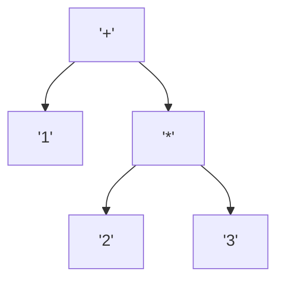
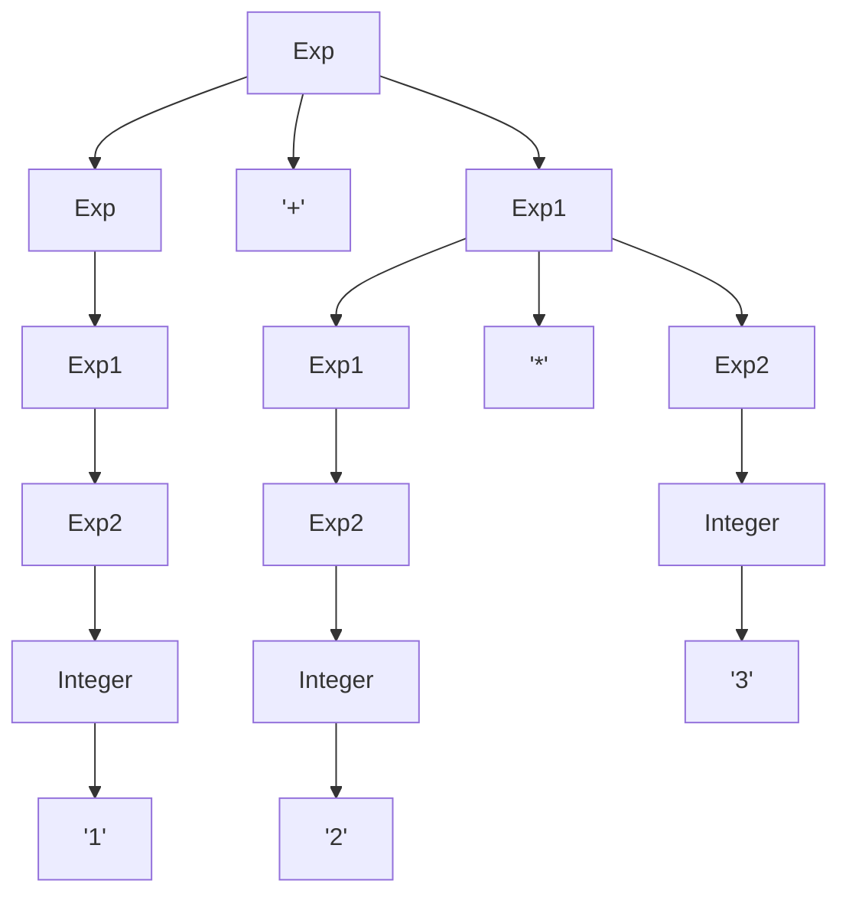

# Expression: 1 + 2 * 3

Using the usual arithmetic precedence, the string `1 + 2 * 3` corresponds to the tree



In order to produce this tree algorithmically, we use the context free grammar

```
Exp -> Exp '+' Exp1
Exp -> Exp1
Exp1 -> Exp1 '*' Exp2
Exp1 -> Exp2
Exp2 -> Integer
Exp2 -> '(' Exp ')'
```

Given the string `1 + 2 * 3` and the grammar, the only tree that produces the string is:



The homework now is a bit like solving a Sudoku: Given the rules of the grammar and a string, what is the unique tree that can be fit to the string.