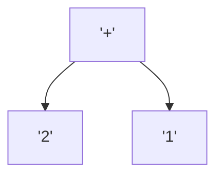
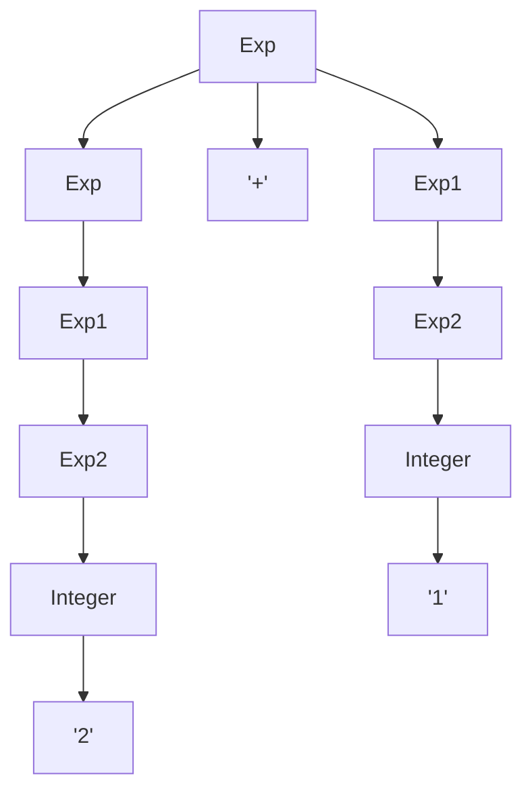
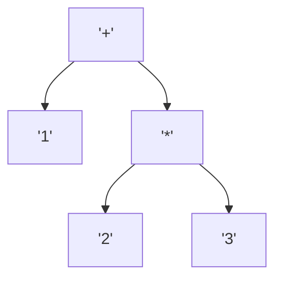
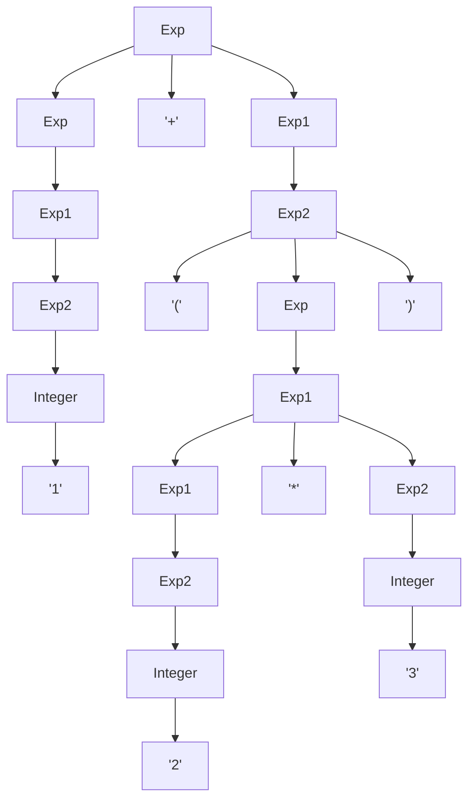
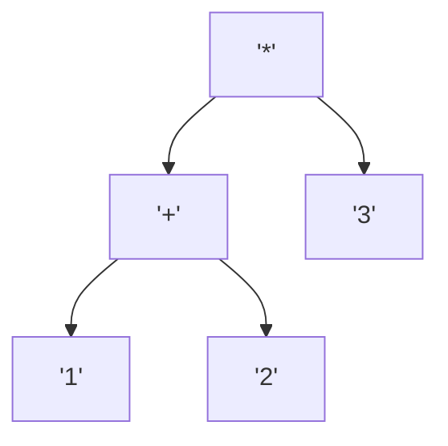
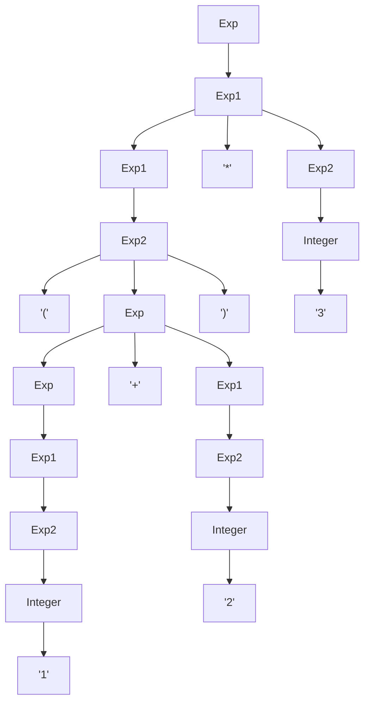
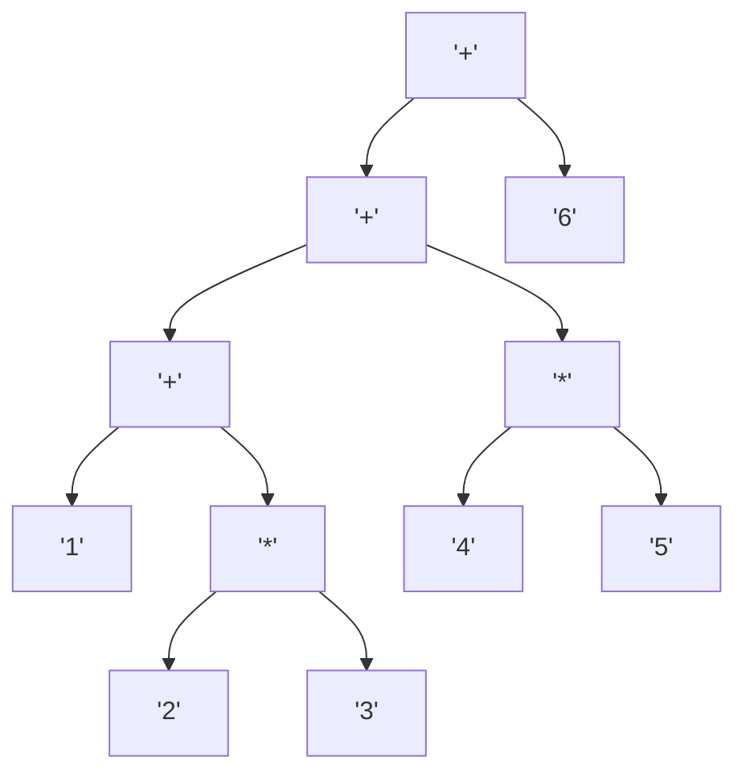
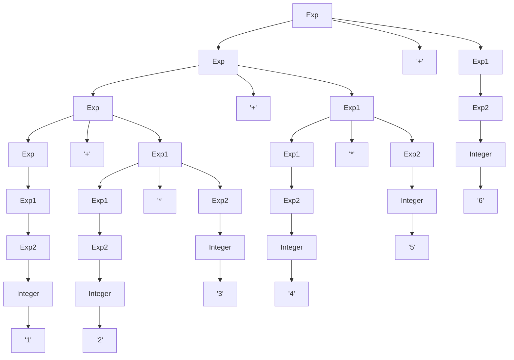

# HW4 solutions: Concrete Syntax Trees

The format follows `123.md`: for each string we first draw the **abstract syntax tree** that the usual rules of arithmetic suggest, and then the unique derivation tree of the grammar — the **concrete syntax tree** — that produces the string.

We use the context-free grammar

```
Exp -> Exp '+' Exp1
Exp -> Exp1
Exp1 -> Exp1 '*' Exp2
Exp1 -> Exp2
Exp2 -> Integer
Exp2 -> '(' Exp ')'
```

`Exp` is the start symbol; `Integer` produces the numerals. The three levels `Exp` / `Exp1` / `Exp2` make `*` bind tighter than `+`, and the left-recursive rules make both operators associate to the left.

## Expression: `2+1`

Using the usual arithmetic precedence, the string `2+1` corresponds to the abstract syntax tree



Given the string `2+1` and the grammar, the only concrete syntax tree that produces the string is:



Note that both operands are wrapped in the chain `Exp -> Exp1 -> Exp2 -> Integer`. The left operand is an `Exp`, the right operand only an `Exp1`: this asymmetry is what will make `+` associate to the left in longer expressions.

## Expression: `1+2*3`

Using the usual arithmetic precedence, the string `1+2*3` corresponds to the abstract syntax tree



Given the string `1+2*3` and the grammar, the only concrete syntax tree that produces the string is:

```mermaid
graph TD
    exp0["Exp"] --> exp1["Exp"]
    exp0 --> plus["'+'"]
    exp0 --> exp10["Exp1"]
    exp1 --> exp11["Exp1"]
    exp11 --> exp20["Exp2"]
    exp20 --> int1["Integer"]
    int1 --> one["'1'"]
    exp10 --> exp12["Exp1"]
    exp10 --> star["'*'"]
    exp10 --> exp21["Exp2"]
    exp12 --> exp22["Exp2"]
    exp22 --> int2["Integer"]
    int2 --> two["'2'"]
    exp21 --> int3["Integer"]
    int3 --> three["'3'"]
```



The right operand of `+` must be an `Exp1`, so the `*` is forced to sit under that `Exp1`. There is no concrete syntax tree in which `+` sits under `*`: the precedence of `*` over `+` is built into the grammar.

## Expression: `1+(2*3)`

Using the usual arithmetic precedence, the string `1+(2*3)` corresponds to the same abstract syntax tree as `1+2*3`:


But the *string* is different, and the concrete syntax tree must account for every symbol, including the parentheses:



The parentheses appear in the concrete syntax tree because of the rule `Exp2 -> '(' Exp ')'`. So `1+2*3` and `1+(2*3)` have the same abstract syntax tree but different concrete syntax trees.

## Expression: `(1+2)*3`

Using the usual arithmetic precedence, the string `(1+2)*3` corresponds to the abstract syntax tree



Given the string `(1+2)*3` and the grammar, the only concrete syntax tree that produces the string is:



The string starts with `'('`, so the outermost operator cannot be `+`. The start symbol must take `Exp -> Exp1`, and that `Exp1` is the product. The parentheses are what allow a `+` to appear *under* a `*`.

## Expression: `1+2*3+4*5+6`

Left-associative `+` reads the string as `((1+(2*3))+(4*5))+6`, that is, as the abstract syntax tree



Given the string `1+2*3+4*5+6` and the grammar, the only concrete syntax tree that produces the string is:



The left spine is the nested `Exp -> Exp '+' Exp1` productions: the left-recursive rule is what makes `+` associate to the left. Each right-hand `Exp1` is either a product (`2*3`, `4*5`) or the final numeral (`6`).
